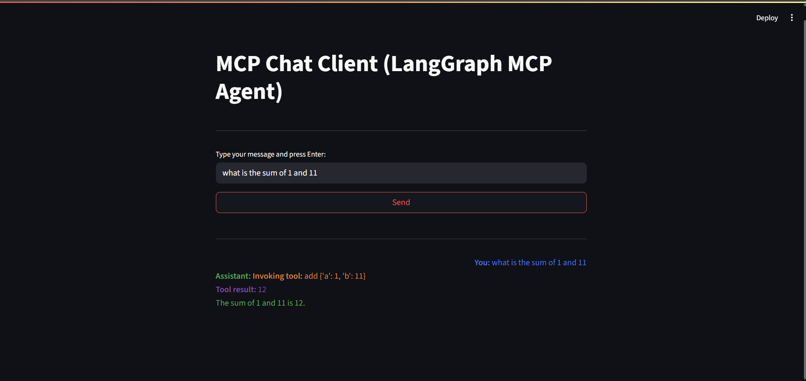

# MCP Healthcare Client - Streamlit UI

<p align="center">
  
</p>

This project is a Streamlit-based webapp that acts as an MCP client using the `langchain-mcp-adapters` and `langgraph` Python modules. It connects to an MCP server, provides a chat interface, streams responses, and execute MCP tool (using LangChain and OpenAI).

## Features
- Chat interface with streaming responses
- Integration with MCP server via `langchain-mcp-adapters`
- Uses LangChain and OpenAI for tool execution


## Getting Started

1. **Install dependencies:**
   ```sh
   pip install -r requirements.txt
   ```

2. **Set up your environment variables:**
   - Create a `.env` file in the project root with the following content:
     ```env
     OPENAI_API_KEY=your-openai-api-key-here
     MCP_SERVER_URL=http://localhost:8000/mcp
     MCP_TOKEN=YOUR_TOKEN
     ```
   - Replace `your-openai-api-key-here` with your actual OpenAI API key.
   - Update `MCP_SERVER_URL` and `MCP_TOKEN` as needed for your MCP server.

3. **Start the MCP server:**
   ```sh
   python server.py
   ```

4. **Run the Streamlit app:**
   ```sh
   streamlit run app.py
   ```

## Project Structure
- `app.py`: Main Streamlit app
- `requirements.txt`: Python dependencies

## References
- [Model Context Protocol](https://modelcontextprotocol.io/introduction)
- [langchain-mcp-adapters](https://github.com/langchain-ai/langchain)
- [LangGraph](https://github.com/langchain-ai/langgraph)
- [OpenAI Python SDK](https://github.com/openai/openai-python)
